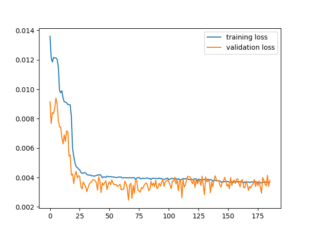
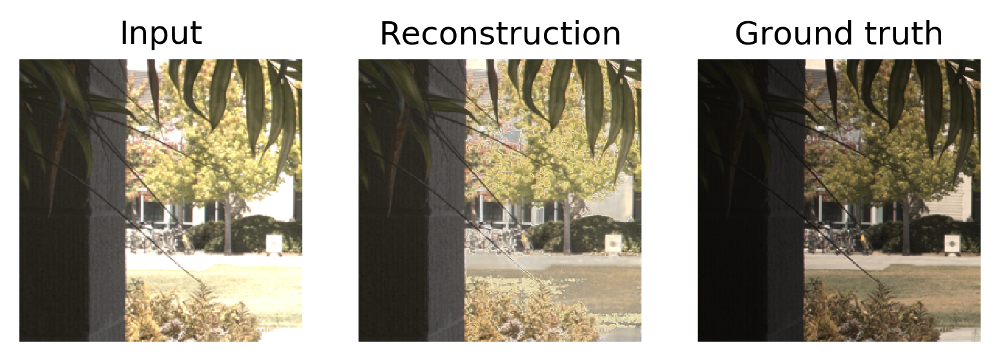
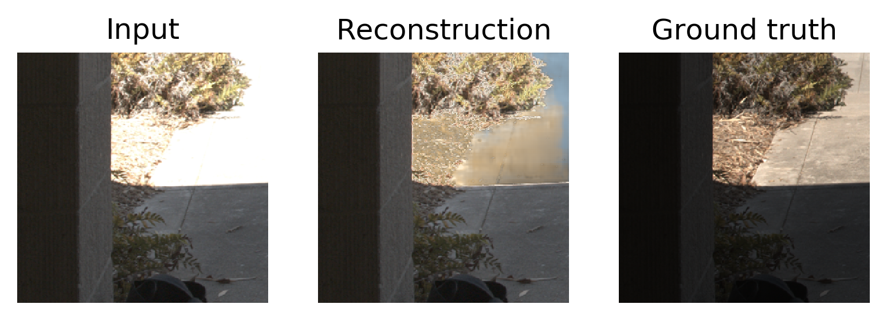
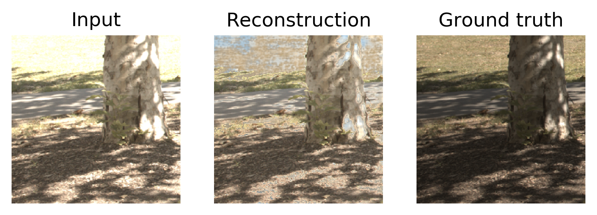
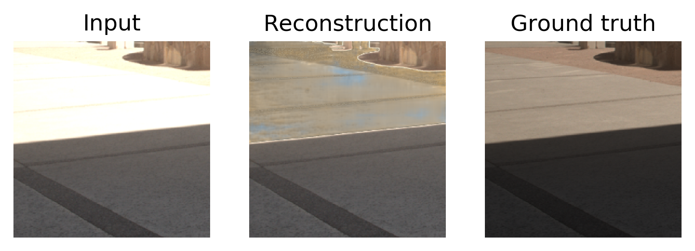
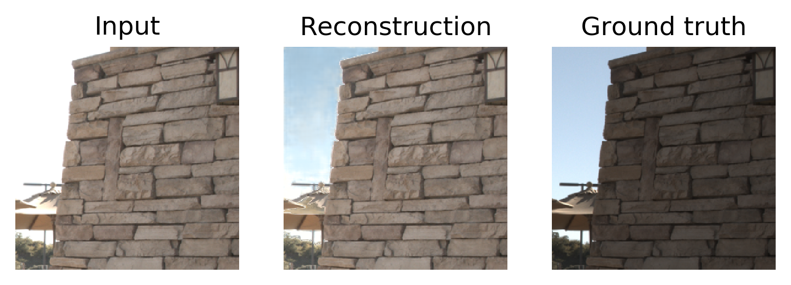

# HDR-reconstruction-using-deep-CNNs
## General
This is the pytorch implementation for HDR reconstruction algorithm using deep CNNs, which was proposed in:
  
*Gabriel Eilertsen, Joel Kronander, Gyorgy Denes, Rafał K. Mantiuk, Jonas Unger, "HDR image reconstruction from a single exposure using deep CNNs," ACM Transactions on Graphics, November 2017*

### Dataset
I used Kalantari's dataset for training and testing purposes, which was downloaded from:  
https://cseweb.ucsd.edu/~viscomp/projects/SIG17HDR/

Since this dataset is used for HDR synthesis task, I only used center images for HDR reconstruction. The LDR and HDR images were split into smaller patches, then an annotation file was created for storing their addresses.
```
python split_image.py
```
Specifically, the annotations.txt file was created, which contains the addresses of pairs of LDR-HDR images, for example:
```
data/train/16-11-04-17/256_512.png	data/train/16-11-04-17/256_512.hdr
data/train/16-11-04-17/0_256.png	data/train/16-11-04-17/0_256.hdr
data/train/16-11-04-17/768_256.png	data/train/16-11-04-17/768_256.hdr
data/train/16-11-04-17/256_0.png	data/train/16-11-04-17/256_0.hdr
data/train/16-11-04-17/768_0.png	data/train/16-11-04-17/768_0.hdr
data/train/16-11-04-17/512_512.png	data/train/16-11-04-17/512_512.hdr
data/train/16-11-04-17/256_256.png	data/train/16-11-04-17/256_256.hdr
data/train/16-11-04-17/512_256.png	data/train/16-11-04-17/512_256.hdr
data/train/16-11-04-17/768_512.png	data/train/16-11-04-17/768_512.hdr
```
### Training
```
python train.py
```
Training and validation loss:

### Testing
```
python predict.py
```
Experimental results:




